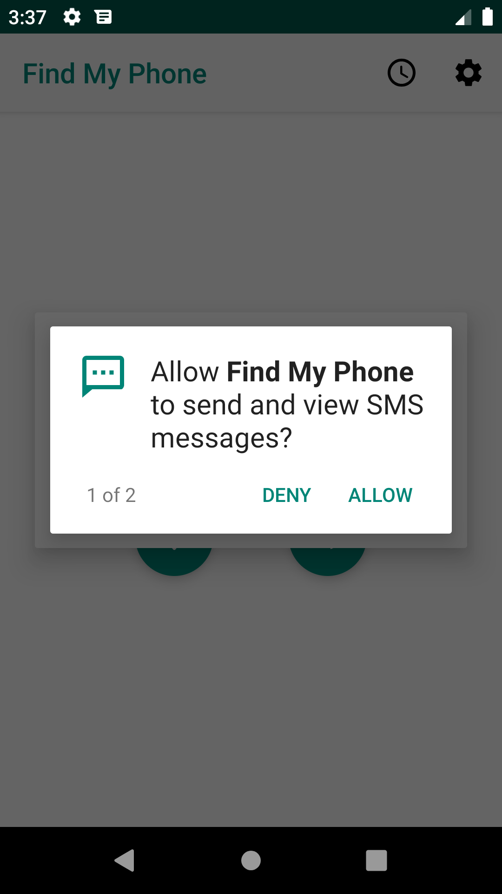
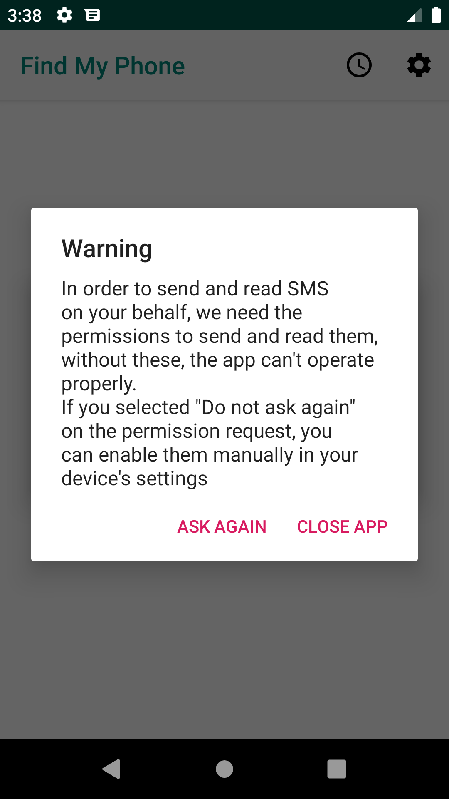
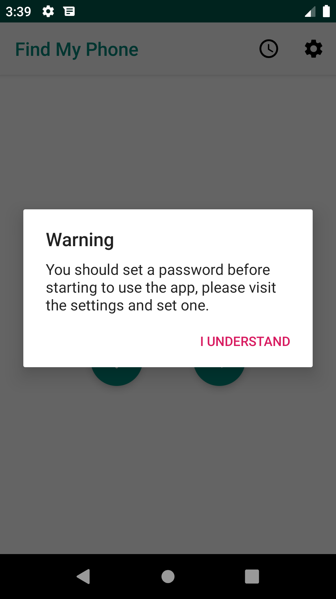
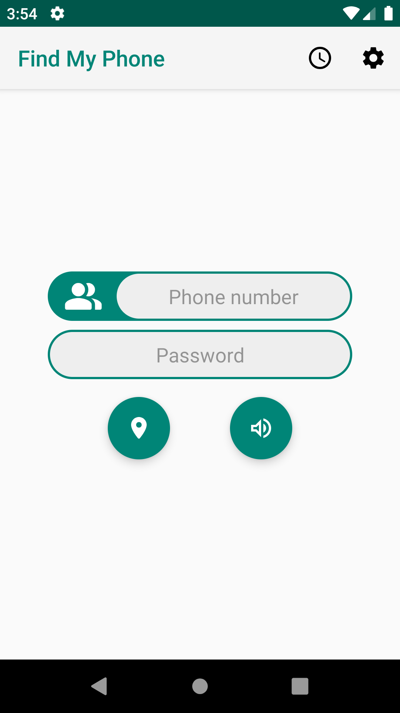
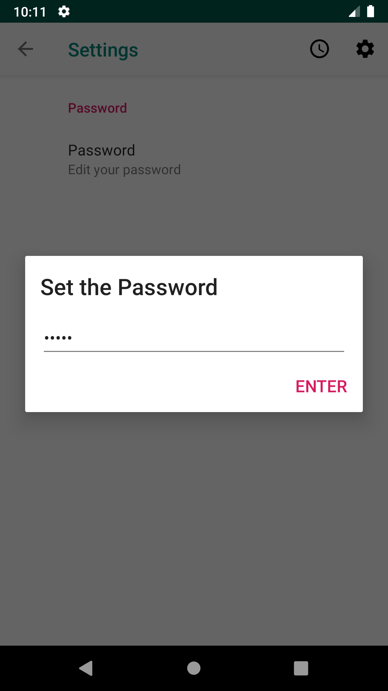
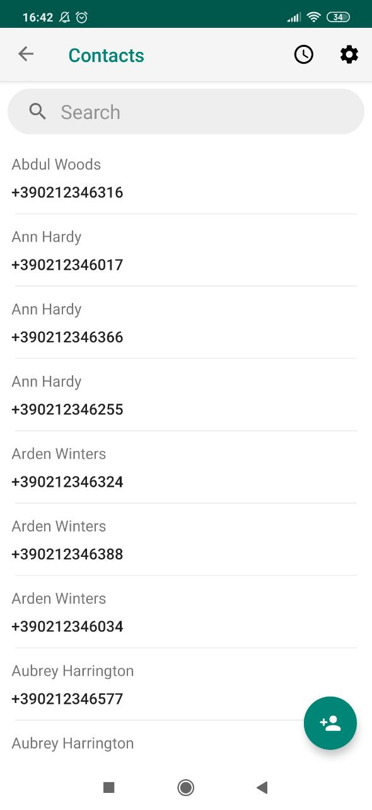
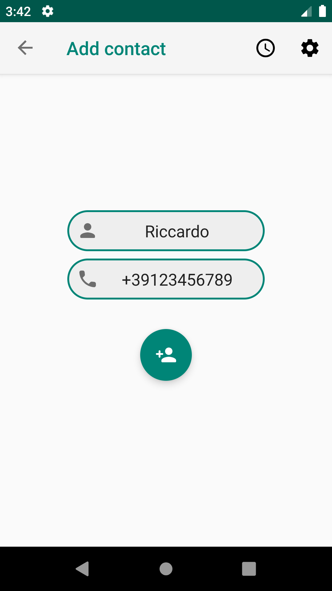
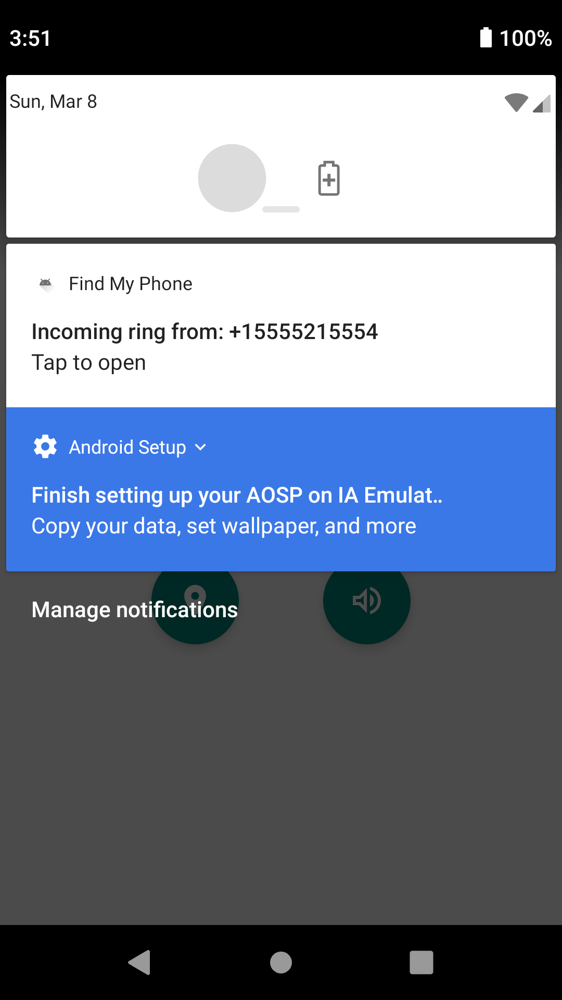
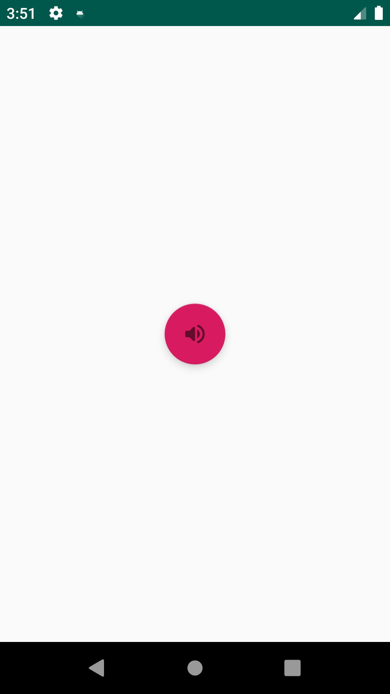
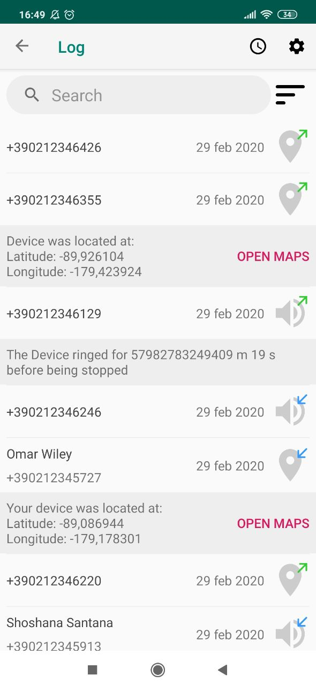

# Readme
The content of this repository is the work of students of the "Elementi di Ingegneria del Software" course held at the University of Padova during the first semester of the 2019/2020 academic year.

## License
The work is licensed under the Apache License, a copy of which is located in the [LICENSE.md](LICENSE.md) file.

Copyright 2020 Riccardo De Zen, Niccolò Turcato, Giorgia Bortoletti, Pardeep Kumar.

Licensed under the Apache License, Version 2.0 (the "License"); you may not use this file except in compliance with the License. You may obtain a copy of the License at

   http://www.apache.org/licenses/LICENSE-2.0

Unless required by applicable law or agreed to in writing, software distributed under the License is distributed on an "AS IS" BASIS, WITHOUT WARRANTIES OR CONDITIONS OF ANY KIND, either express or implied. See the License for the specific language governing permissions and limitations under the License.

## Introduction
Find My Phone is the result of the work of group 1 for the above mentioned course.
It is an application meant to send messages to another device with the intention of either making in play its ringtone or send back another message with its current position.

When first installing the app, the user is prompted with a couple of dialogs asking for permissions to read the SMS and access the location of the device.

If the user refuses one or more permissions, a dialog is displayed explaining what the permission is used for. The example below shows the Dialog for the SMS permissions.

After accepting all permissions, a dialog suggesting that the user sets a password is shown.

This is the main screen of the app. Contains a field for the phone number and for a password the above phone number uses. The app bar above is shared by the whole app, except for the alarm screen. When one of the two buttons is pressed, a message is sent after being encrypted with the given password.
If a message is received, and after being deciphered with our password results in a valid message from this app, an appropriate response is elaborated. If it was a ring request, the device begins ringing and a notification is shown for up to two minutes, if stopped before such timeout it sends back the elapsed time, otherwise, the device just sends back its location, if the GPS is on.

In the settings screen, opened through the gear icon on the app bar the password can be set by interacting with the following dialog.

The contact screen is opened through the contact icon attached to the phone number input field, and contains a list of contacts that can be filtered by name. Contacts support swipe gestures to modify (right) or delete (left) them.

When clicking on the green button at the bottom right angle, another screen appears that can be used to add a new contact.

When the app receives a ring request the following notification is shown. It can be clicked to open an activity that allows terminating the ring. After two minutes the service stops itself.

This is the activity mentioned above, when the button in the middle is pressed, a response message is sent back containing the time that elapsed between the start of the ring and the button touch.

The log screen, accessible through the clock icon in the app bar, shows a summary of the performed operations. If an item is touched it expands showing the result of said operation. Each item supports swipe gestures, to delete (left) it or to add a new contact (right) if the item is associated to a phone address that is not registered in the contacts, in this last case the add contact screen is opened with the number already set.

